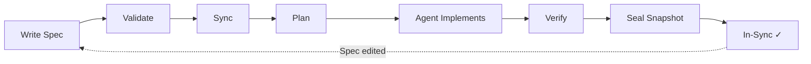

# SpecMan

**Spec-driven development for codebases managed by AI agents.**

SpecMan keeps human intent and machine execution in sync. You write specifications describing *what* your software should do; agents implement *how*. SpecMan tracks which specs the codebase reflects, detects when specs drift from implementation, and orchestrates the sync loop that brings them back together.

## Quick Start

```bash
# Initialize SpecMan in your repo
specman init

# Create your first spec
specman new "User authentication"

# Edit the spec — fill in Intent and Acceptance Criteria
$EDITOR specs/FEAT-0001-user-authentication.md

# Validate your specs
specman validate

# See what needs implementation
specman status

# Generate a sync plan
specman sync FEAT-0001

# After implementation, seal editorial changes
specman seal FEAT-0001
```

## How It Works



**Specs are the source of truth.** Every feature starts as a markdown spec with structured metadata and acceptance criteria. The spec describes intent and success criteria; it never prescribes implementation.

**Snapshots track implementation state.** When a sync completes, SpecMan saves a snapshot of the spec as it was when the code was written. Future edits to the spec create *drift* — the difference between what's implemented and what's specified.

**The sync loop bridges the gap.** When drift is detected, SpecMan generates a plan targeting only the changed acceptance criteria, the agent implements against that plan, verification commands confirm correctness, and a new snapshot seals the result.

## Documentation

- **[Philosophy](docs/philosophy.md)** — Why spec-driven development, and the principles behind SpecMan's design
- **[Workflow Guide](docs/workflow.md)** — Day-to-day usage with diagrams showing the full lifecycle
- **[Writing Specs](docs/writing-specs.md)** — How to write effective specifications
- **[Command Reference](docs/commands.md)** — Every command, flag, and exit code
- **[Spec Format](docs/spec-format.md)** — The spec file format in detail

## Example Specs

- [FEAT-0099 Account Settings Screen](docs/examples/FEAT-0099-account-settings-screen.md) — a UI feature spec
- [UI-0001 Design System Baseline](docs/examples/UI-0001-design-system-baseline.md) — a design system spec

## Project Status

SpecMan is self-hosted — its own development is managed by its own specs. See the `specs/` directory for the full specification suite.
