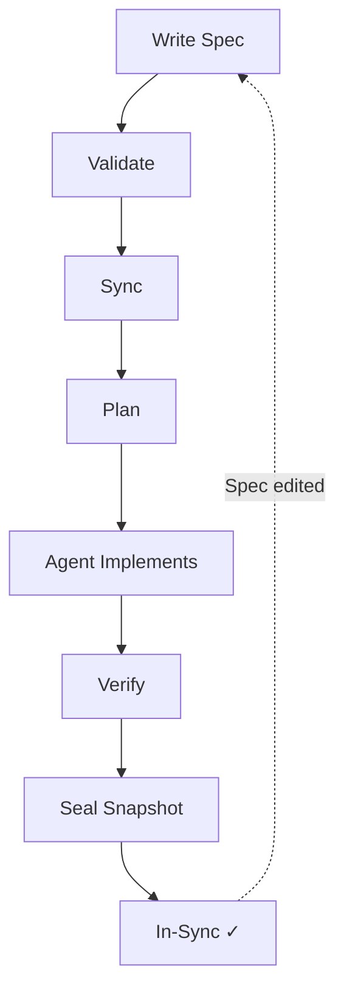

# SpecMan

**Spec-driven development for codebases managed by AI agents.**

Modern AI coding agents can write code fast — but they need clear targets. Humans know _what_ they want, but expressing it precisely and keeping that expression in sync with reality is hard. Without a system, agents implement from vague prompts, nobody knows which features are actually implemented, and there's no audit trail connecting "why we built this" to "what was built."

SpecMan solves this by introducing a clear division of responsibilities:

| Role           | Responsibility                                                                        |
| -------------- | ------------------------------------------------------------------------------------- |
| 🧑 **Human**   | Writes specs — describes **what** the system should do (intent + acceptance criteria) |
| 🤖 **Agent**   | Implements **how** — writes code and tests based on the spec                          |
| 🔧 **SpecMan** | Manages **state** — detects drift, generates sync plans, verifies results             |

## Quick Start

```bash
# Initialize SpecMan in your repo
specman init

# Create your first spec
specman new "User authentication"

# Edit the spec — fill in Intent and Acceptance Criteria
$EDITOR specs/FEAT-0001-user-authentication.md

# Validate your specs
specman validate

# See what needs implementation
specman status

# Generate a sync plan for the agent
specman sync FEAT-0001

# After implementation, verify and seal
specman verify FEAT-0001
specman seal --initial FEAT-0001
```

## How It Works



### Specs are the source of truth

Every feature starts as a Markdown spec with structured metadata and acceptance criteria (ACs). The spec describes intent and success criteria — it never prescribes implementation. Only AC changes trigger the sync loop; rewording the Intent section is an editorial change that can be sealed without involving the agent.

### Snapshots track implementation state

When a sync completes, SpecMan saves a byte-level snapshot of the spec as it was when the code was written. No fragile version counters — just a file comparison. Future edits to the spec create _drift_: the difference between what's implemented and what's specified.

### Incremental sync bridges the gap

When drift is detected, SpecMan generates a plan targeting **only the changed acceptance criteria**. If you add one new AC to a spec with three existing ones, the agent implements only the new one — existing work is untouched. Verification commands confirm correctness, and a new snapshot seals the result.

### Dependency-aware ordering

Specs declare dependencies via `depends_on`. When syncing multiple specs, SpecMan processes them in the right order. If one spec's sync fails, its dependents are skipped while independent specs continue.

## Documentation

- **[Philosophy](docs/philosophy.md)** — Why spec-driven development, and the principles behind SpecMan's design
- **[Workflow Guide](docs/workflow.md)** — Day-to-day usage with diagrams showing the full lifecycle
- **[Writing Specs](docs/writing-specs.md)** — How to write effective specifications
- **[Command Reference](docs/commands.md)** — Every command, flag, and exit code
- **[Spec Format](docs/spec-format.md)** — The spec file format in detail

## Example Specs

- [FEAT-0099 Account Settings Screen](docs/examples/FEAT-0099-account-settings-screen.md) — a UI feature spec
- [UI-0001 Design System Baseline](docs/examples/UI-0001-design-system-baseline.md) — a design system spec

## Project Status

SpecMan is self-hosted — its own development is managed by its own specs. See the `specs/` directory for the full specification suite.
