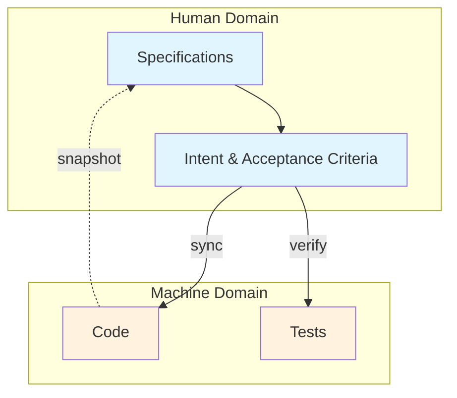
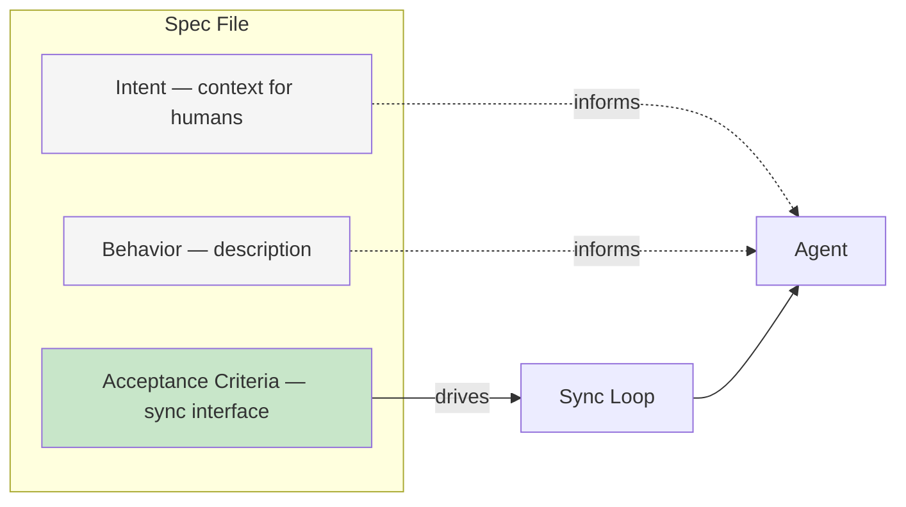
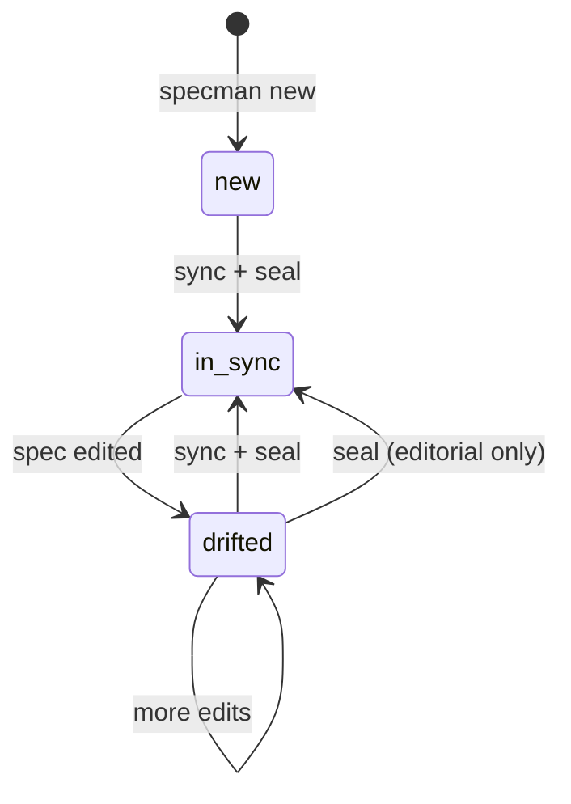
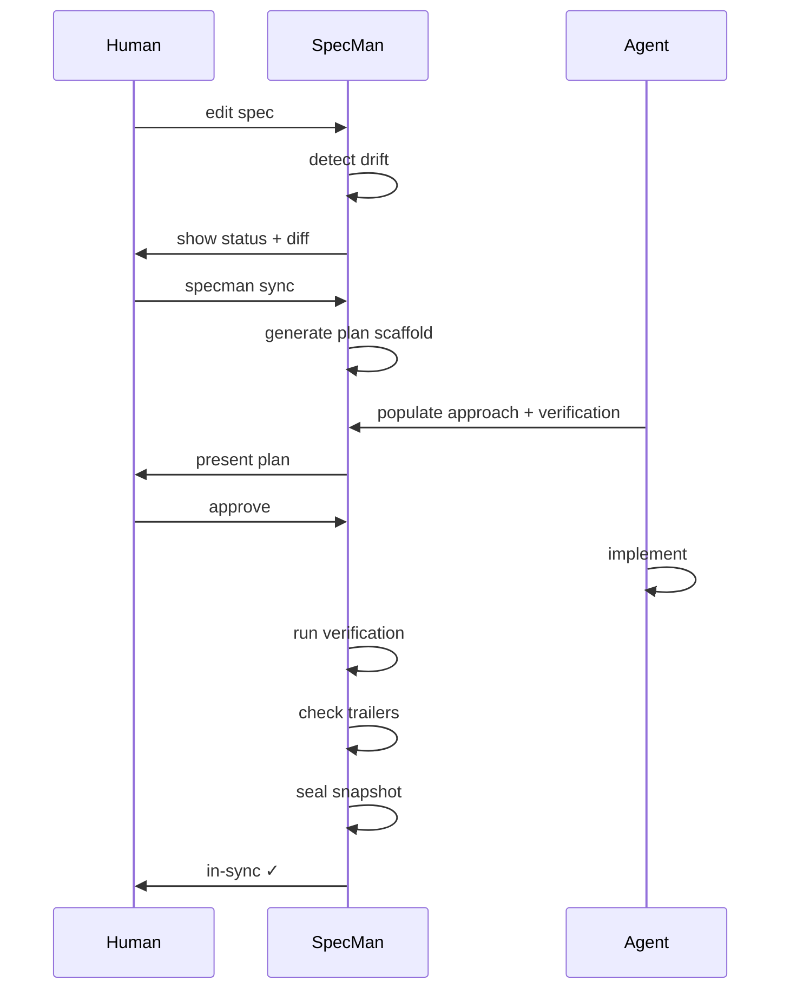

# Philosophy

## The Problem

Modern software development with AI coding agents has a coordination problem. Agents can write code fast, but they need clear targets. Humans know *what* they want, but expressing it precisely — and keeping that expression in sync with reality — is hard.

Without a system:
- Agents implement from vague prompts, producing code that drifts from intent
- Nobody knows which features are implemented, partially implemented, or specified-but-not-started
- Editing a requirement means guessing what code needs to change
- There's no audit trail connecting "why we built this" to "what was built"

## The Solution: Specs as Source of Truth

**Specs describe what. Code implements how.** The arrow runs one direction: specs → code. Code never modifies specs. When reality changes, humans update specs first, then sync brings the code into alignment.

## Core Principles

### 1. Acceptance Criteria Are the Interface

ACs are the only part of a spec that drives implementation work. The Intent section provides context. The Behavior section describes the feature. But only AC changes trigger the sync loop.

This means:
- Rewording the Intent section? **Seal** — no code change needed.
- Adding a new AC? **Sync** — the agent implements it.
- Changing an AC's success criteria? **Sync** — the agent updates the implementation.

### 2. Drift Is a Feature, Not a Bug

When you edit a spec, it *should* drift from the snapshot. Drift is the signal that says "the spec has moved ahead of the code." SpecMan doesn't try to prevent drift — it detects it, measures it, and provides the tools to resolve it.

The three states:
- **`new`** — spec exists but has never been implemented
- **`drifted`** — spec has been edited since last sync
- **`in-sync`** — implementation matches the spec

### 3. Plans Are Auditable Contracts

Before any code is written, SpecMan generates a plan that shows exactly what will change. The human reviews and approves. The agent implements against the plan. The plan is committed alongside the snapshot — it's the answer to "what did we intend when we last synced this spec?"

### 4. Snapshots, Not Counters

Previous approaches tracked "which version is implemented" with version numbers or timestamps in frontmatter. These invariants are fragile — any non-editor edit, history rewrite, or careless merge silently corrupts them.

SpecMan uses **byte-level snapshots**: a copy of the spec at the moment implementation was sealed. Drift is a file comparison, not a counter comparison. No invariant to maintain, no signal to corrupt.

### 5. One Spec, One Sync

Each sync targets exactly one spec. No cross-spec reasoning within a single sync — this keeps plan scope predictable and blast radius contained. Multi-spec workflows process specs in dependency order, one at a time.

## The Human-Agent Boundary

SpecMan owns the **specification state machine** — it knows what's drifted, what the drift set is, and when implementation matches intent. The agent owns the **implementation** — it writes code, tests, and verification commands. The human owns **intent** — they write specs, review plans, and approve execution.
