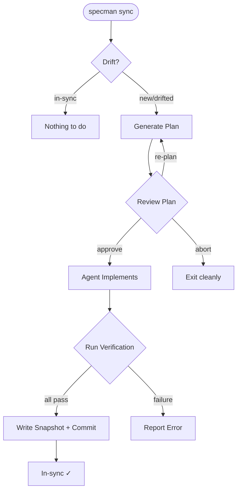
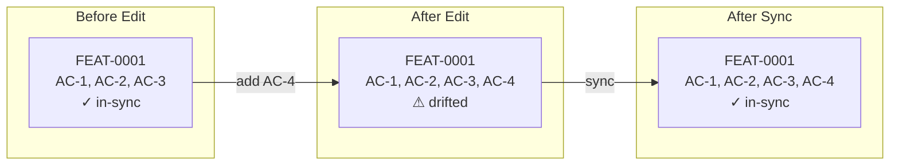
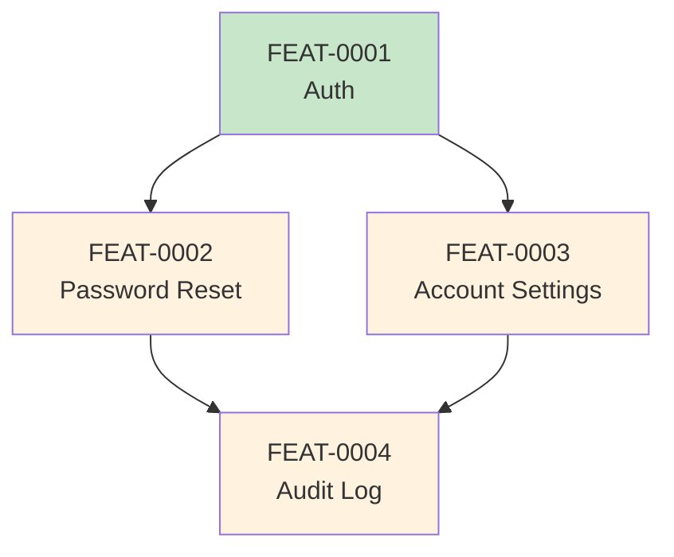

# Workflow Guide

This guide walks through the complete SpecMan lifecycle — from project setup through spec evolution.

## 1. Project Setup

```bash
cd your-project
specman init
```

This creates:
```
your-project/
├── specs/                      # Your spec files go here
├── .specman/
│   ├── implemented/            # Snapshots of synced specs
│   └── plans/                  # Sync plans
└── ... your code ...
```

Commit the layout:
```bash
git add specs/ .specman/
git commit -m "chore: initialize specman"
```

## 2. Writing Your First Spec

```bash
specman new "User authentication"
# → specs/FEAT-0001-user-authentication.md
```

Open the file and fill in the scaffold:

```markdown
---
id: FEAT-0001
title: User authentication
status: draft
depends_on: []
---

## Intent

Allow users to create accounts and authenticate securely.

## Behavior

Users sign up with email and password. Passwords are hashed
with bcrypt. Sessions use JWT tokens with 24-hour expiry.

## Acceptance criteria

- AC-1: Given a new email, signing up creates an account and returns a session token.
- AC-2: Given valid credentials, logging in returns a JWT token.
- AC-3: Given an active session, logging out invalidates it.
```

Validate and commit:
```bash
specman validate    # 1 spec checked. 0 errors.
git add specs/ && git commit -m "spec: user authentication"
```

## 3. The Sync Loop



### Generate a plan

```bash
specman sync FEAT-0001
# → FEAT-0001: plan scaffold written to .specman/plans/FEAT-0001.md
```

The plan shows one section per AC in the drift set:

```markdown
# Sync plan — FEAT-0001 User authentication

Started: 2026-04-19T14:30:00Z
Snapshot state: new
Drift summary: 3 added (whole spec)

## AC-1 (added): Given a new email, signing up creates an account...

Approach: <!-- agent fills in -->
Files: <!-- agent fills in -->

## AC-2 (added): Given valid credentials, logging in returns a JWT...

Approach: <!-- agent fills in -->
Files: <!-- agent fills in -->

## Verification

- `deno test --allow-all`
```

### Preview without generating plans

```bash
specman sync --dry-run
# FEAT-0001 new: 3 added
# FEAT-0002 drifted: 1 modified, 1 added
```

## 4. After Implementation

Once the agent (or you) has implemented the spec:

### Verify the plan

```bash
specman verify FEAT-0001
# Running: deno test --allow-all
# ✓ All verification commands passed. Tree is clean.
```

### Seal the snapshot

For first-time implementation (no prior snapshot):
```bash
specman seal --initial FEAT-0001
# FEAT-0001: sealed (initial snapshot created).
```

For subsequent syncs, sealing happens as part of the sync commit.

## 5. Spec Evolution

This is where SpecMan shines — managing change over time.

### Adding a feature

```bash
specman new "Password reset"
# Edit the spec...
specman validate
specman sync FEAT-0002
```

### Modifying an existing spec

Edit the spec to add or change acceptance criteria:

```bash
$EDITOR specs/FEAT-0001-user-authentication.md
# Add: AC-4: Given 3 failed logins, lock the account for 15 minutes.

specman status
# FEAT-0001 drifted  (changed since last sync)

specman status --diff
# Shows exactly what changed:
# +- AC-4: Given 3 failed logins, lock the account for 15 minutes.

specman sync FEAT-0001
# Plan targets ONLY AC-4 — existing ACs are not re-implemented
```



### Editorial changes (no AC impact)

Sometimes you reword the Intent or update the status without changing any ACs:

```bash
# Change status from draft to active
$EDITOR specs/FEAT-0001-user-authentication.md
git add -A && git commit -m "spec: mark FEAT-0001 as active"

specman status
# FEAT-0001 drifted  (changed since last sync)

specman seal FEAT-0001
# FEAT-0001: sealed (editorial change, snapshot updated).
```

Seal is the fast path — no plan, no agent, no verification.

## 6. Multi-Spec Workflows

```bash
specman sync    # no ID — syncs all drifted/new specs
```

SpecMan processes specs in **dependency order** using `depends_on`:



If FEAT-0001 is synced first (no dependencies), then FEAT-0002 and FEAT-0003 (depend on 0001), then FEAT-0004 (depends on both).

**Failure cascading:** If FEAT-0002's sync fails, FEAT-0004 is skipped (depends on FEAT-0002), but FEAT-0003 continues (independent of FEAT-0002).

## 7. Deleting Specs

```bash
specman delete FEAT-0003
# Removed specs/FEAT-0003-account-settings.md
# Removed .specman/implemented/FEAT-0003.md
# Removed .specman/plans/FEAT-0003.md
```

Deletes the spec file, its snapshot, its plan, and any assets. Dependents are warned but the delete proceeds.

Preview first:
```bash
specman delete FEAT-0003 --dry-run
```

## Cheat Sheet

| Scenario | Command |
|----------|---------|
| Start a project | `specman init` |
| Create a spec | `specman new "Title"` |
| Check for errors | `specman validate` |
| See drift status | `specman status` |
| See what changed | `specman status --diff` |
| Preview sync scope | `specman sync --dry-run` |
| Generate sync plan | `specman sync FEAT-0001` |
| Sync all drifted specs | `specman sync` |
| Run verification | `specman verify FEAT-0001` |
| Seal editorial change | `specman seal FEAT-0001` |
| Seal initial impl | `specman seal --initial FEAT-0001` |
| Delete a spec | `specman delete FEAT-0001` |
| Delete (preview) | `specman delete FEAT-0001 --dry-run` |
